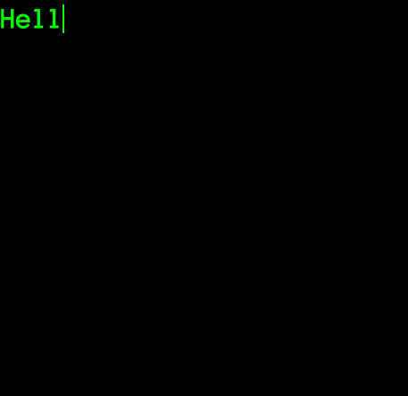

# type-writer
type-writer is a css typewriter animation library that lets you realize typewriter effect easily

### Usage

```html
<script src="type-writer.js"></script>
```

```html
<h1 class="typist">Hello world!</h1>
<p class="typist">你好，我是一个打字动画效果库！</p>
```

If you are using english, please use a monospaced font!

eg:

```css
@import url(http://fonts.googleapis.com/css?family=Anonymous+Pro);
body { font-family: 'Anonymous Pro', monospace; }
```



### License

MIT


